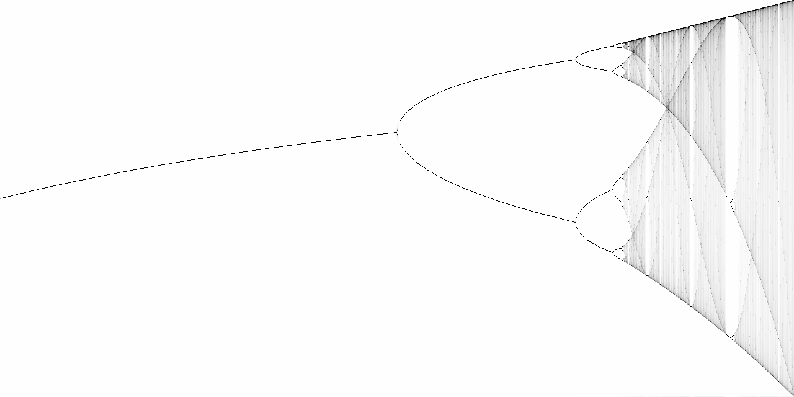
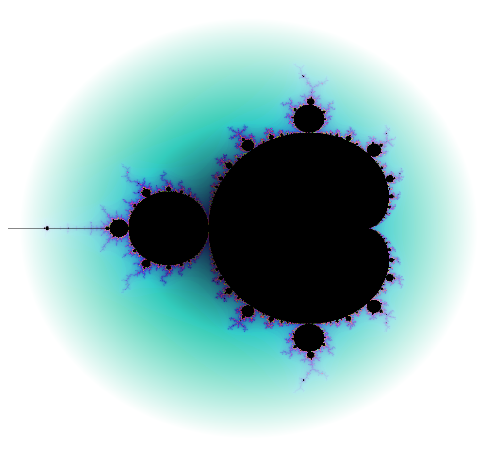

# Bifurcation and fractal generation

This is mostly for getting more proficient in Rust and to learn about fractal and chaotic systems with an artistic cherry on top.

## Image synthesis

### Feigenbaum diagrams

So far the diagram generation is pretty slow. There are a few optimizations that could be interesting to implement. On top of that, the diagram would benefit from multi-sampling to connect the broken up lines in the diagram.

### Mandelbrot set

As with the Feigenbaum diagram, the implementation so far is super rudimentary. As a PoC it works, but there are definitely ways to improve both performance and render quality.

## Outlook

I might add more generators for bifurcation diagrams and fractals.
